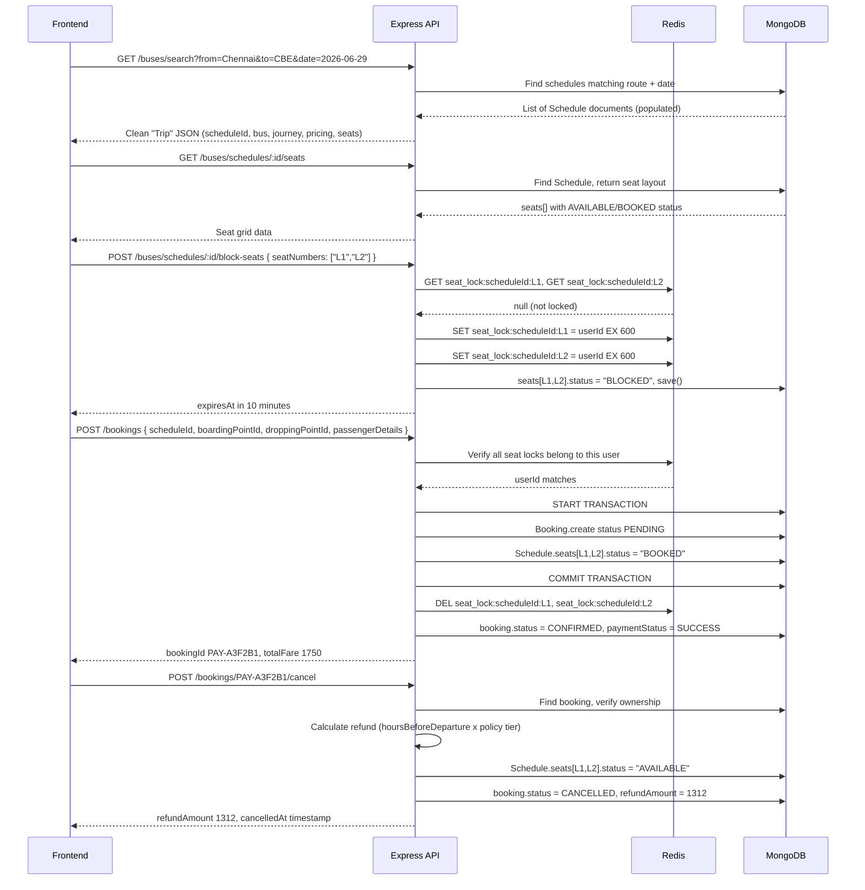

# Payanam Bus Booking — Architecture Guide

> **Target audience:** Junior developers joining the project, or engineers preparing for system design interviews.

---

## 1. End-to-End Booking Lifecycle

Below is the complete user journey from search to cancellation.



---

## 2. How Express req/res Works

Every HTTP request in Express travels through a **middleware pipeline**.

```
Browser/Postman
     |
     |  POST /api/v1/bookings
     v
[ app.js global setup ]
  cors() -> express.json() -> cookieParser()
     |
     v
[ booking.routes.js ]
  authenticate -> validate(schema) -> createBooking controller
     |
     v
[ authenticate middleware ]
  - reads JWT from cookie
  - verifies signature
  - sets req.user = { _id, role }
  - calls next()
     |
     v
[ validate middleware ]
  - runs Zod schema against req.body / req.params / req.query
  - throws 400 if invalid
  - calls next()
     |
     v
[ createBooking controller ]
  - extracts req.user._id, req.body
  - calls bookingService.createBookingService()
  - res.status(201).json({ success, data })
     |
     v
[ createBookingService ]
  - checks Redis locks
  - queries MongoDB
  - returns booking object
```

**Key insight:** Each function either calls `next()` (pass to next middleware) or `next(error)` (jump to global error handler).

---

## 3. Route → Controller → Service Pattern

| Layer | File | Responsibility |
|-------|------|----------------|
| **Route** | `booking.routes.js` | Register URL + HTTP method, apply middleware chain |
| **Controller** | `booking.controller.js` | Extract from `req`, call service, format `res` |
| **Service** | `booking.service.js` | All business logic, DB queries, Redis operations |
| **Model** | `booking.model.js` | Mongoose schema, pre-save hooks, indexes |

**Why this separation?**
- Services can be **unit-tested** without spinning up an Express server.
- Controllers stay thin — they never contain DB queries.
- If you need to call `createBookingService` from a cron job or CLI script, you can import it directly without any Express dependency.

---

## 4. Redis Locking Flow

### Why Redis and not MongoDB?

MongoDB can handle concurrent writes, but checking + writing availability in two separate operations creates a **race condition window**:

```
User A reads seat L1 → AVAILABLE
User B reads seat L1 → AVAILABLE  (same instant!)
User A books L1 → BOOKED
User B books L1 → BOOKED  ← DOUBLE BOOKING!
```

Redis solves this because `SET key value EX ttl` is **atomic** — runs as a single operation with no gap.

### Our Redis Key Structure

```
seat_lock:{scheduleId}:{seatNumber}
                         value = userId string
```

Example: `seat_lock:665f1a2b3c4d5e6f7a8b9c0d:L1 = "507f1f77bcf86cd799439011"`

**Value** is the `userId` string, so we can verify the lock owner.
**TTL** is 600 seconds (10 min). Redis auto-expires the key, releasing the seat if checkout is abandoned.

### Redis Pipeline

Instead of 5 separate network round-trips for 5 seats, we use `redis.pipeline()`:

```javascript
const pipeline = redis.pipeline();
for (const seat of seats) {
    pipeline.set(`seat_lock:${scheduleId}:${seat}`, userId, "EX", 600);
}
await pipeline.exec(); // One network call, 5 commands — 5x faster
```

---

## 5. Seat Blocking Lifecycle

```
User selects seats on frontend
    |
    v
POST /schedules/:id/block-seats
    |
    For each seatNumber:
    1. Does seat exist?          -> No  -> 400 error
    2. Is seat.status BOOKED?    -> Yes -> 409 error
    3. Does Redis lock exist?    -> Yes, by other user -> 409 error
    |
    v
Redis pipeline: SET all locks (TTL 600s)
MongoDB: Update seat statuses to "BLOCKED"
    |
    v
setTimeout(610s): Cleanup job
  - If Redis lock expired AND seat still "BLOCKED" -> revert to "AVAILABLE"
    |
    v
Return { expiresAt: "10 minutes from now" }
```

> **Production upgrade:** Replace `setTimeout` with BullMQ (Redis-backed job queue). `setTimeout` is killed if the Node process restarts.

---

## 6. Booking Lifecycle

```
POST /bookings
    |
    Phase A: Redis Verification
        - Verify all seat_lock keys exist AND belong to current userId
    |
    Phase B: Schedule Loading
        - Load Schedule with populated Bus data
        - Resolve boardingPoint and droppingPoint by _id
        - Calculate totalFare (sum of each seat's fare)
    |
    Phase C: MongoDB Transaction (ATOMIC)
        - Booking.create({ status: "PENDING" })
        - Schedule.seats[each].status = "BOOKED"
        - Schedule.availableSeats -= count
    |
    Phase D: Release Redis locks
        - DEL seat_lock:* for all booked seats
    |
    Phase E: Mock Payment + Confirm
        - booking.paymentStatus = "SUCCESS"
        - booking.bookingStatus = "CONFIRMED"
        - booking.bookedAt = now
```

---

## 7. Cancellation Lifecycle

```
POST /bookings/:bookingId/cancel
    |
    1. Find booking by bookingId string (e.g., "PAY-A3F2B1")
    2. Ownership check: booking.userId === req.user._id
    3. Status check: booking.bookingStatus === "CONFIRMED"
    4. Refund Calculation:
         hoursUntilDeparture = (departureDate - now) / (1000 * 60 * 60)
         Walk through policy tiers (sorted by hoursBeforeDeparture DESC):
         [ {48h: 100%}, {24h: 75%}, {12h: 50%}, {0h: 0%} ]
         First matching tier wins.
         refundAmount = totalFare x (refundPercentage / 100)
    5. Release seats: Schedule.seats.status = "AVAILABLE"
    6. Update booking: CANCELLED, refundAmount, cancelledAt
```

### Refund Calculation Examples

| Fare | Hours until departure | Matching tier | Refund |
|------|-----------------------|---------------|--------|
| Rs 875 | 50h | 48h → 100% | Rs 875 |
| Rs 875 | 30h | 24h → 75% | Rs 656 |
| Rs 875 | 18h | 12h → 50% | Rs 437 |
| Rs 875 | 5h | 0h → 0% | Rs 0 |
| Rs 875 | -2h (past departure) | none | Rs 0 |

---

## 8. Review Lifecycle

```
POST /buses/:busId/reviews
    |
    1. Verify Bus exists
    2. Prevent duplicate: Review.findOne({ bookingId }) → 409 if found
    3. Review.create({ userId, busId, bookingId, rating, review })
    4. Update Bus aggregate rating:
         Review.aggregate([
           { $match: { busId } },
           { $group: { avgRating: { $avg: "$rating" }, total: { $sum: 1 } } }
         ])
         bus.averageRating = Math.round(avgRating * 10) / 10
         bus.totalRatings = total
```

**Why aggregation instead of incremental update?**
Incremental updates can drift due to floating-point errors over thousands of reviews. Aggregation recalculates from scratch — always accurate.

---

## 9. MongoDB Collections

| Collection | Model | Description |
|-----------|-------|-------------|
| `users` | `User` | Customers + vendors |
| `buses` | `Bus` | Bus config, seat layout template, ratings |
| `routes` | `Route` | Source → destination with ordered stops |
| `schedules` | `Schedule` | A bus on a specific date/time; owns the live seat status array |
| `bookings` | `Booking` | Confirmed tickets; snapshot of data at booking time |
| `reviews` | `Review` | User ratings for buses, 1 per booking |

### Why `Schedule.seats[]` is denormalized

Storing seats directly inside the Schedule (not in a separate collection) is intentional:
- **Pro:** Seat reads are a single document fetch (no joins needed).
- **Pro:** Atomic seat status updates via Mongoose sessions.
- **Con:** Document size grows with seat count (~200 seats × ~200 bytes = ~40KB per Schedule — well within MongoDB's 16MB limit).

---

## 10. Real-World Scaling Considerations

### Current architecture (good for ~10k bookings/day)

```
Client → Express (single process) → MongoDB → Redis
```

### Scaling to 1M+ bookings/day (RedBus scale)

| Problem | Solution |
|---------|----------|
| Express is single-threaded | PM2 cluster mode + Node worker threads |
| Redis single point of failure | Redis Cluster or Sentinel |
| MongoDB write contention | Sharding on scheduleId |
| Seat locks lost on crash | BullMQ (Redis-backed job queue) instead of setTimeout |
| Search is slow at scale | Elasticsearch for full-text search |
| Payment webhooks overwhelm | RabbitMQ/AWS SQS for async processing |
| Ticket PDF generation | AWS Lambda + S3 |

---

## 11. Interview Questions & Answers

**Q: Why block seats in Redis instead of immediately booking in MongoDB?**

Booking requires payment confirmation (2–30 seconds). During that time, the seat must be held for the paying user but not permanently committed. Redis TTL gives us a temporary reservation that automatically expires if payment fails — no manual cleanup needed.

---

**Q: What happens if the server crashes between creating the Booking and marking seats BOOKED?**

We use a **MongoDB session (transaction)**. Steps Booking.create and Schedule.save run inside `session.withTransaction()`. If either fails, both roll back automatically. No orphaned bookings, no ghost seat marks.

---

**Q: How do you prevent two users from booking the same seat simultaneously?**

Three-layer protection:
1. **Redis lock** (atomic): `SET seat_lock:id:seat userId EX 600` is a single Redis operation.
2. **MongoDB transaction** (second layer): Even if two requests slip through, only one transaction wins.
3. **Seat status check** in service: If `seat.status !== "AVAILABLE"`, throw 409 before attempting the write.

---

**Q: Why snapshot the cancellationPolicy inside the Booking document?**

If the operator updates their policy after a user books, the user should be refunded based on the policy they agreed to at booking time. Snapshotting gives us an immutable contract.

---

**Q: Why use `bookingId: "PAY-A3F2B1"` instead of MongoDB's `_id`?**

1. **UX:** "PAY-A3F2B1" is memorable; `665f1a2b3c4d5e6f7a8b9c0d` is not.
2. **Security:** Hiding the ObjectId prevents users from guessing adjacent bookings by incrementing.
3. **Portability:** If you migrate from MongoDB, the PNR format stays stable.

---

**Q: What is the difference between `bookingStatus` and `paymentStatus`?**

They model two independent state machines:
- `bookingStatus`: ticket lifecycle — PENDING → CONFIRMED → CANCELLED.
- `paymentStatus`: money lifecycle — PENDING → SUCCESS → REFUNDED.

A booking can be CONFIRMED but then REFUNDED (after cancellation). Separating them lets you handle each workflow independently.

---

**Q: How does `.populate()` work internally in Mongoose?**

When Mongoose sees `ref: "Bus"` on a field, it knows the field stores an ObjectId. When you call `.populate("busId")`, Mongoose runs a second query (`Bus.find({ _id: { $in: [...ids] } })`) and merges results back. It's a client-side JOIN.

**Performance tip:** Always add `.select()` to only fetch the fields you need — don't populate entire documents unnecessarily.
